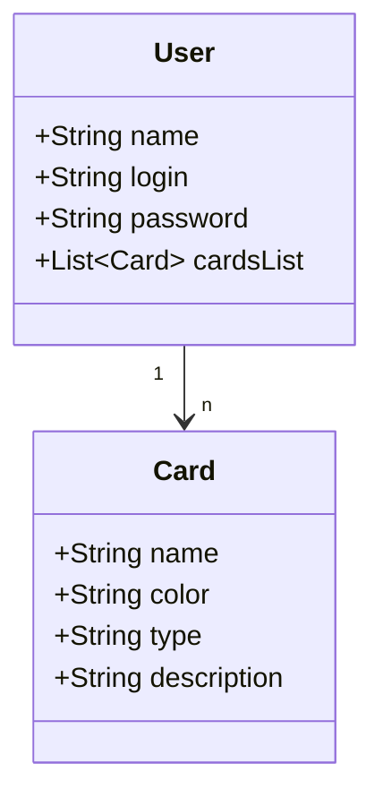

# Esse é o projeto do santander Dev week Publicando API com postgrees e Railway
Infelizmente o railway nao permitiu que eu colocasse meu codigo nele, mas felizmente consegui implementar a aplicacao e subir ela com banco de dados em nuvem!

## Requisicao a partir de um feing client
Para a API Scryfall será enviado o texto extraido da imagem com o nome da carta para pesquisa no banco de dados e retorno no formato json apenas das informacoes
que necessitamos na montagem de nossa lista. Utilizando esse formato "https://api.scryfall.com/cards/named?fuzzy=nome+da+carta" sera possivel realizar a consulta.

## Diagrama de classes

## Videos Uteis:
- como pedir acesso a camera com javascript em pagina html: https://www.youtube.com/watch?v=CBWkMNo6px8
- autenticacao com roles no spring security: https://www.youtube.com/watch?v=5w-YCcOjPD0
- upload and download an image with spring(indian): https://www.youtube.com/watch?v=7L1BSy5pnGo
- upload an image with spring (american): https://www.youtube.com/watch?v=yrT2WI7UpMo
